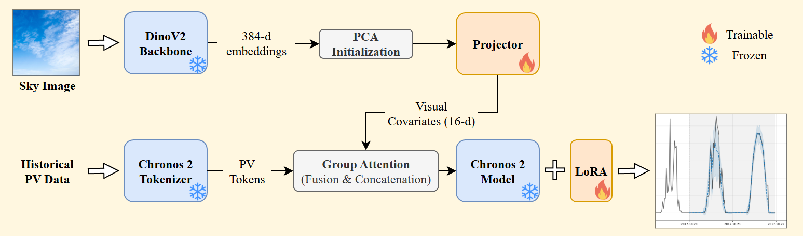

# Foundation Model for Time Series Forecasting with Multimodal Vision Integration

A comprehensive framework for photovoltaic (PV) power generation forecasting that combines **Chronos 2** foundation model with **DinoV2** visual embeddings through a learnable vision projector. This project explores how sky imagery can enhance time series predictions.

## 📋 Table of Contents

- [Overview](#overview)
- [Architecture](#architecture)
- [Project Structure](#project-structure)
- [Installation](#installation)
- [Workflow Pipeline](#workflow-pipeline)
- [Module Descriptions](#module-descriptions)
- [Usage](#usage)
- [Configuration](#configuration)

---

## Overview

This project implements a multimodal time series forecasting system that:

1. **Prepares the SKIPP'D (benchmark version) dataset** with intelligent gap-filling and timezone handling
2. **Extracts visual features** from sky images using DinoV2 (Vision Transformer)
3. **Trains baseline models** using AutoGluon with Chronos/Chronos-2
4. **Fine-tunes Chronos 2** using Chronos 2 pipeline with LoRA/DoRA adapters using tabular covariates
5. **Projects visual embeddings** into the Chronos latent space via a learnable MLP projector

> **Key Innovation**: A `VisionProjector` module that transforms 384-dimensional DinoV2 embeddings into 16-dimensional "synthetic covariates" that Chronos can interpret as additional time series channels.

---

## Architecture


### Vision Projector Architecture

```
Input (384-dim DinoV2 CLS Token)
    │
    ▼
Linear(384 → 128) + Dropout
    │
    ▼
Linear(128 → 16)
    │
    ▼
Output (16-dim Synthetic Covariates)
```

The projector can be initialized with PCA weights for stable training convergence.

---

## Project Structure

```
Foundation_Model_for_Time_Series/
│
├── baseline/                    # Chronos baseline experiments
│   ├── baseline.py             # Main baseline training/evaluation script
│   ├── utils.py                # Metrics (MASE, MAPE, wMAPE) and plotting
│   └── results/                # Output plots and predictions
│
├── dataset/                     # Data preparation pipeline
│   ├── config.py               # Paths, timezone, imputation thresholds
│   ├── prepare_for_chronos_correct_timezone.py  # Full preprocessing pipeline
│   └── skippd_data/            # Raw and processed parquet files
│
├── extract_visual_info/         # DinoV2 feature extraction
│   └── DinoV2_extract_sly_image.py  # Extract + PCA reduce sky features
│
├── fine_tune/                   # Standard Chronos fine-tuning
│   ├── manual_pipeline_fn.py   # LoRA/DoRA fine-tuning with tabular covariates
│   └── utils/                  # Backtesting and plotting utilities
│       ├── cv.py               # Cross-validation logic
│       └── plotting_utils.py   # Visualization helpers
│
├── projector_model/             # Multimodal Chronos with Vision Projector
│   ├── multimodal_chronos.py   # VisionProjector + MultimodalChronos classes
│   ├── multimodal_dataset.py   # PyTorch datasets for training
│   ├── train_multimodal_infinite.py  # Two-phase training script
│   ├── precompute_embeddings.py      # Pre-extract DinoV2 embeddings
│   ├── initialize_projector_with_pca.py  # PCA-based weight init
│   ├── run_visualization.py    # Inference and evaluation
│   └── utils/                  # Common utilities
│       ├── config.py           # Centralized configuration
│       ├── data_utils.py       # Data loading and splitting
│       ├── metrics.py          # Evaluation metrics
│       ├── training_utils.py   # PEFT configs, validation
│       └── visualization_utils.py  # Plotting functions
│
└── requirements.txt             # Python dependencies
```

---

## Installation

### Prerequisites

- Python 3.10+
- CUDA-capable GPU (recommended: 12GB+ VRAM)

### Setup

```bash
# Clone the repository
git clone <repository-url>
cd Foundation_Model_for_Time_Series

# Create virtual environment
python -m venv venv
source venv/bin/activate  # Linux/Mac
# or: .\venv\Scripts\activate  # Windows

# Install dependencies
pip install -r requirements.txt
```

### Additional Dependencies

The core dependencies include:

| Package | Purpose |
|---------|---------|
| `chronos-forecasting` | Amazon Chronos 2 foundation model |
| `transformers` | DinoV2 and model utilities |
| `peft` | LoRA/DoRA adapters |
| `autogluon.timeseries` | Baseline model training |
| `torch` | Deep learning framework |
| `pandas`, `numpy` | Data manipulation |
| `scikit-learn` | PCA and preprocessing |

---

## Workflow Pipeline

### Step-by-Step

#### 1. Dataset Preparation

```bash
cd dataset
python prepare_for_chronos_correct_timezone.py
```

**What it does:**
- Loads raw SKIPPD solar data
- Applies timezone correction (America/Los_Angeles)
- Resamples to 30-minute intervals
- Implements tiered gap-filling:
  - Night hours (20:00-08:00) → Zero-fill
  - < 4 hours → Forward fill
  - < 25 hours → Previous day copy
  - < 1 week → Previous week copy
  - Large gaps → Series segmentation
- Applies ad-hoc fixes for known data issues

#### 2. Visual Feature Extraction (Optional - for baseline)

```bash
cd extract_visual_info
python DinoV2_extract_sly_image.py
```

**What it does:**
- Loads sky images from dataset
- Extracts DinoV2 CLS token embeddings (384-dim)
- Applies PCA to reduce to 10 components
- Saves enriched parquet with `sky_feature_*` columns

#### 3. Precompute Embeddings (for Projector Training)

```bash
cd projector_model
python precompute_embeddings.py
```

**What it does:**
- Extracts raw DinoV2 embeddings (without PCA)
- Saves as `visual_embedding` column for projector training
- Much faster training since embeddings are computed once

#### 4. Initialize Projector with PCA

```bash
python initialize_projector_with_pca.py
```

**What it does:**
- Fits PCA on visual embeddings
- Initializes projector weights to replicate PCA transform
- First layer: PCA components
- Second layer: Identity pass-through
- Provides stable starting point for training

#### 5. Train Multimodal Chronos

```bash
python train_multimodal_infinite.py
```

**Training Phases:**

| Phase | Description | Trainable Parameters |
|-------|-------------|---------------------|
| Phase 1 | Projector Warmup | VisionProjector only |
| Phase 2 | Joint Training | Projector + LoRA adapters |

**Features:**
- Random sampling from dataset
- Gradient accumulation
- OneCycleLR scheduler
- Periodic validation and checkpointing

#### 6. Evaluation

```bash
python run_visualization.py
```

**What it does:**
- Loads trained checkpoint (projector + LoRA)
- Projects visual embeddings to covariates
- Runs prediction with enriched covariates
- Plots forecasts with confidence intervals
- Computes metrics (MASE, MAPE, wMAPE)

---

## Module Descriptions

### `baseline/`

Standard Chronos training using AutoGluon's TimeSeriesPredictor.

**Key Features:**
- Supports both Chronos-Bolt and Chronos-2 models
- Optional sky feature integration (PCA-reduced)
- Covariate regressor support
- Comprehensive evaluation metrics

### `dataset/`

Robust data preparation with sophisticated imputation.

**Imputation Strategy:**
```
Gap Duration          → Strategy
─────────────────────────────────
Night hours           → Zero-fill (no sun)
< 4 hours             → Forward fill
< 25 hours            → Copy from yesterday
< 1 week              → Copy from last week
≥ 1 week              → Split into new series
```

### `fine_tune/`

Manual Chronos fine-tuning with PEFT adapters.

**Supported Adapters:**
- LoRA (Low-Rank Adaptation)
- DoRA (Weight-Decomposed Low-Rank Adaptation)

### `projector_model/`

The core multimodal integration module.

**Key Classes:**

| Class | Description |
|-------|-------------|
| `VisionProjector` | 2-layer MLP projecting 384→16 dimensions |
| `MultimodalChronos` | Combines projector + Chronos pipeline |
| `RandomMultimodalDataset` | Infinite random sampling for training |
| `MultimodalDataset` | Deterministic dataset for validation |

---

## Usage

### Quick Start - Baseline

```python
from baseline.baseline import load_and_prepare, fit_model

# Load data
df = load_and_prepare("path/to/data.parquet")

# Train models
train_data, bolt_predictor, cv2_predictor = fit_model(df)
```

### Quick Start - Multimodal

```python
from projector_model.multimodal_chronos import MultimodalChronos

# Initialize model
model = MultimodalChronos(
    chronos_model_name="amazon/chronos-2",
    vision_model_name="facebook/dinov2-small",
    covariate_dim=16,
    use_precomputed_embeddings=True
)

# Forward pass
outputs = model(
    context_tensor=context,      # (B, T) PV values
    pixel_values=embeddings,     # (B, T, 384) visual embeddings
    future_target=future_values  # (B, pred_len) targets
)

loss = outputs.loss
```

---

## Configuration

All hyperparameters are centralized in `projector_model/utils/config.py`:

```python
# Model
VISION_MODEL = "facebook/dinov2-small"
CHRONOS_MODEL = "amazon/chronos-2"
COVARIATE_DIM = 16        # Projected visual feature dimension
HIDDEN_DIM = 128          # Projector hidden layer size

# Training
CONTEXT_LENGTH = 2048     # Historical context window
PREDICTION_LENGTH = 96    # Forecast horizon (48 hours @ 30min)
BATCH_SIZE = 4
LEARNING_RATE = 1e-4
MAX_STEPS = 100           # Phase 2 training steps
PROJECTOR_WARMUP_STEPS = 150  # Phase 1 steps

# Regularization
DROPOUT = 0.2             # Projector dropout
NOISE_STD = 0.05          # Gaussian noise on embeddings
MAX_GRAD_NORM = 1.0       # Gradient clipping
```

### Environment Variables

The project uses a `.env` file for configuration. To set up:

1. Copy the example file:
   ```bash
   cp .env.example .env
   ```

2. Edit `.env` with your data paths:
   ```bash
   FM_DATA_DIR=/path/to/your/data/directory
   ```

The `.env` file is automatically loaded by the configuration module. Alternatively, you can set environment variables directly:

```bash
# Linux/Mac
export FM_DATA_DIR="/path/to/your/data"

# Windows PowerShell
$env:FM_DATA_DIR="C:\path\to\your\data"
```

---

## Metrics

The project uses standard time series forecasting metrics:

| Metric | Formula | Interpretation |
| :--- | :--- | :--- |
| **MASE** | MAE / MAE(naive) | Scale-independent error |
| **MAPE** | Mean(\|error\| / \|actual\|) × 100 | Percentage error |
| **wMAPE** | Sum(\|error\|) / Sum(\|actual\|) × 100 | Weighted percentage error |
| **WQL** | 2 × Σ max(q(y - ŷ), (1-q)(ŷ - y)) / Σ\|y\| | Weighted quantile loss for probabilistic forecasts |
| **SQL** | WQL / WQL(seasonal naive) | Scale-free quantile loss (like MASE for quantiles) |

---

## Acknowledgments

- **Amazon Science** - Chronos foundation model
- **Meta AI** - DinoV2 vision transformer
- **Hugging Face** - Transformers and PEFT libraries
- **SKIPPD Dataset** - Solar irradiance data with sky images

---
