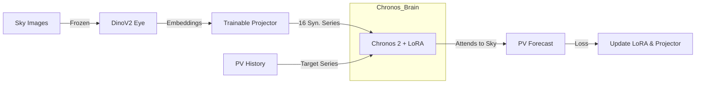

# System Walkthrough: Multimodal Chronos 2 Execution

This document explains exactly what happens step-by-step when you run `train_multimodal.py`.

## 1. Initialization Phase
**"Building the Brain"**

1.  **Data Loading (`MultimodalDataset`)**:
    *   The script reads your Parquet file containing `timestamp`, `pv_value` (solar power), and `image` (sky photos).
    *   It creates a **sliding window** over your time series. For example, if context is 512 and prediction is 96, it grabs a chunk of length 608.
2.  **Model Loading**:
    *   **The Eye (DinoV2):** Loads `facebook/dinov2-small` and immediately **freezes** it (no training). It is cast to `bfloat16` to save memory.
    *   **The Translator (VisionProjector):** Initializes a fresh, trainable MLP (`Linear -> ReLU -> Linear`) to map 384-dim visual features to 16-dim covariates.
    *   **The Brain (Chronos 2):** Loads `amazon/chronos-2`. It attaches **LoRA adapters** to the attention layers (`q, k, v, o`). Only these adapters are trainable.

## 2. The Training Loop (Per Batch)
**"The Learning Process"**

When a batch of data (one time series chunk + corresponding images) enters the GPU:

### Step A: Vision Encoding
1.  **Input:** A sequence of sky images matching the time series length (e.g., 608 images).
2.  **DinoV2:** Processes each image independently to extract a high-level semantic vector (384 numbers). *Result: "This is a dark cloud", "This is clear blue sky".*
3.  **Projector:** The MLP compresses this 384-vector into 16 numbers. *Result: "Solar output should drop by 80%", "Solar output max".*

### Step B: The "Group Attention" Trick
Chronos needs to know that these 16 numbers are related to the PV values. We use a **Group Attention** strategy:
1.  **Flattening:** We don't feed the 16 numbers as "extra columns". Instead, we split them into **16 separate "Visual Time Series"**.
2.  **Grouping:** We tell Chronos: *"Hey, these 16 visual series and this 1 PV series all belong to Group #1."*
3.  **Result:** Inside the Transformer, the PV series attends to the Visual series. When Chronos tries to predict the next PV value, it "looks at" the corresponding tokens in the Visual series to get context.

### Step C: Masked Forecasting (The Forward Pass)
Chronos 2 uses a **Masked Prediction** objective:
1.  It takes the PV history (Context).
2.  It takes the *entire* Visual history and future (since we assume weather forecasts/images are available).
3.  It tries to predict the **PV Future**.
4.  **Loss Masking:** CRITICAL. We tell the model to **ONLY** grade itself on predicting the **PV values**. It is NOT punished for failing to predict the *images* (we don't care if it can generate sky pixels).

### Step D: Backpropagation (The Update)
1.  The Loss (difference between predicted PV quantiles and actual PV) is calculated.
2.  **Gradient Flow:**
    *   Updates **LoRA weights** (Teaching Chronos *how* to use the visual clues).
    *   Updates **Projector weights** (Teaching the Projector *what* visual clues are important).
    *   **STOPS** at DinoV2 (The eye remains fixed).

## 3. Saving
At the end, two files are saved:
1.  `vision_projector.pth`: The learned "Translator" layer.
2.  `chronos_lora_adapter`: The fine-tuned "skills" for Chronos.

## Summary Diagram

